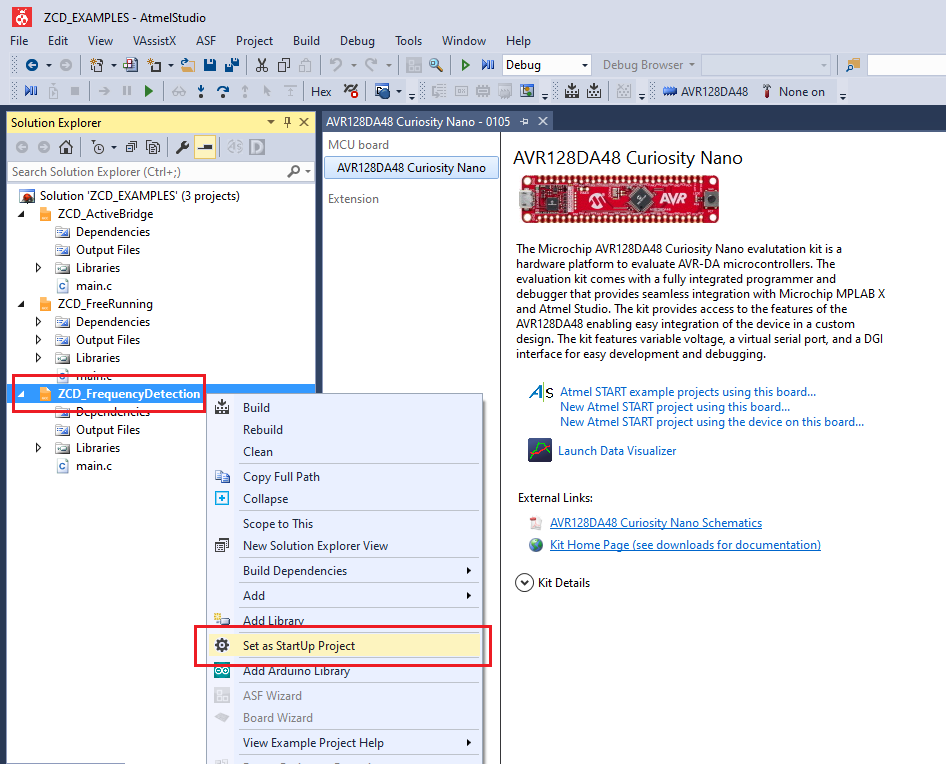

 <article class="markdown-body entry-content p-3 p-md-6" itemprop="This needs to locked down and 'never' changed">

# Generating PWM Signals Using TCD with High-Frequency Input

This repository contains examples of bare metal source code for ZCD as described in [*TB3233 - Using ZCD to Implement Special Functions*](https://www.microchip.com/wwwappnotes/appnotes.aspx?appnote=en1001524) document from Microchip. The repository contains an Atmel Studio Solution (*ZCD_EXAMPLES.atsln*) with three projects inside, one project for each illustrated use case.

Use cases:
1. Free-Running to External I/O (*ZCD_FreeRunning* project)
 - *Use case description:* This example shows how to use the ZCD to detect when the zero value of an analog signal is reached (for
example, the zero-cross of the Alternating Current mains electricity).
 - *Result:* A PWM representation of a sinusoidal AC signal, while the ZCD is working independently of the CPU.
2. AC Signal Frequency Detection (*ZCD_FrequencyDetection* project)
 - *Use case description:* This example describes how to use the ZCD together with a timer to measure the pulse duration and/or the
period of analog signals with minimal intervention of the CPU.
 - *Result:* To enable frequency measurement, the TCB is configured in Frequency Measurement mode, having the EVSYS as
input, which is used to route the ZCD0 output through event channel 0 to the TCB event input. In the Input Capture
Frequency Measurement mode, the TCB captures the counter value and restarts on either a positive or negative
edge of the event input signal. The CAPT Interrupt flag is automatically cleared after the low byte of the Compare/
Capture (TCBn.CCMP) register has been read. An OVF interrupt and event is generated when the CNT reaches
maximum value.
3. Active Bridge Control Signal Generation (*ZCD_ActiveBridge* project)
 - *Use case description:* This example describes how to use the ZCD together with the CPU to create a Pulse Width Modulated (PWM)
and inverted PWM depiction of the Alternating Current (AC) signal, to control an active bridge.
 - *Result:* An implementation of an active bridge driven with the help of the ZCD peripherals

## Related Documentation
More details and code examples on the AVR128DA48 can be found at the following links:
- [*TB3233 - Using ZCD to Implement Special Functions*](https://www.microchip.com/wwwappnotes/appnotes.aspx?appnote=en1001524)
- [AVR128DA48 Product Page](https://www.microchip.com/wwwproducts/en/AVR128DA48)
- [AVR128DA48 Code Examples on GitHub](https://github.com/microchip-pic-avr-examples?q=avr128da48)
- [AVR128DA48 Project Examples in START](https://start.atmel.com/#examples/AVR128DA48CuriosityNano)

## Software Used
- Atmel Studio 7.0.2397 or newer [(microchip.com/mplab/avr-support/atmel-studio-7)](https://www.microchip.com/mplab/avr-support/atmel-studio-7)
- AVR-Dx 1.0.18 or newer Device Pack

## Hardware Used
- AVR128DA48 Curiosity Nano [(DM164151)](https://www.microchip.com/Developmenttools/ProductDetails/DM164151)

## Setup for Use Case #1
**Free-Running to External I/O**

The AVR128DA48 Curiosity Nano Development Board is used as test platform.
 

 The following configurations must be made for this project:

 ZCD:
 - Enable the ZCD
 - Enable the output of the ZCD

|Pin           | Configuration                               |
| :----------: | :-----------------------------------------: |
|PA7           | Digital Output                              |
|PD1           | Interrupt and digital input buffer disabled |

## Operation for Use Case #1
**Free-Running to External I/O**
1. Connect the board to the PC.

2. Open the *ZCD_EXAMPLES.atsln* solution in Atmel Studio

3. Set *ZCD_FreeRunning* project as StartUp project:
 

4. Build the *ZCD_FreeRunning* project: right click on *ZCD_FreeRunning* and select Build
 

5. Select the AVR128DA48 Curiosity Nano on-board debugger in the *Tool* section of the *ZCD_FreeRunning* project settings:
  - Right click on the project and click *Properties*;
  - Click *Tool* tab on the left panel, select the corresponding debugger and save the configuration (Ctrl + S)
 

6. Program *ZCD_FreeRunning* project to the board: select *ZCD_FreeRunning* project and click *Start Without Debugging*:
 

 **Results**
 ZCD_OUT is represented by Channel 1 (orange) in the screenshot below
 ZCD_IN is represented by Channel 3 (blue) in the screenshot below
 

## Setup for Use Case #2
**AC Signal Frequency Detection**

 The following configurations must be made for this project:

 Clock:
 - OSCHF as main clock source
 - OSCHF frequency set to 4 MHz

 TCB0:
 - Input Capture Frequency
 - Event Input Enable: enabled
 - Capture or Timeout: enabled
 - CLK_PER/2 (From Prescaler)
 - TCB enabled
 - Run Standby: enabled

 EVSYS:
 - Zero-cross detector 0 out linked to Event Channel 0
 - TCB uses Event Channel 0

 ZCD:
 - Enable the ZCD
 - Enable the output of the ZCD

|Pin           | Configuration                               |
| :----------: | :-----------------------------------------: |
|PA7           | Digital Output                              |
|PD1           | Interrupt and digital input buffer disabled |

## Operation for Use Case #2
**AC Signal Frequency Detection**

1. Set *ZCD_FrequencyDetection* project as StartUp project:
 

2. Build the *ZCD_FrequencyDetection* project: right click on *ZCD_FrequencyDetection* and select Build
 

3. Select the AVR128DA48 Curiosity Nano on-board debugger in the *Tool* section of the *ZCD_FrequencyDetection* project settings:
  - Right click on the project and click *Properties*;
  - Click *Tool* tab on the left panel, select the corresponding debugger and save the configuration (Ctrl + S)
 

4. Program *ZCD_FrequencyDetection* project to the board: select *ZCD_FrequencyDetection* project and click *Start Without Debugging*:
 

## Setup for Use Case #3
**Active Bridge Control Signal Generation**

 The following configurations must be made for this project:

 Clock:
 - OSCHF as main clock source
 - OSCHF frequency set to 4 MHz

 EVSYS:
 - Zero-cross detector 0 out linked to Event Channel 0
 - Event system output B (PB2) uses Event Channel 0
 - Zero-cross detector 1 out linked to Event Channel 1
 - Event system output C (PC2) uses Event Channel 1

 ZCD0:
 - Enable the ZCD0

  ZCD1:
  - Enable the ZCD1
  - Invert the ZCD1 OUTPUT

|Pin           | Configuration                               |
| :----------: | :-----------------------------------------: |
|PD1           | Interrupt and digital input buffer disabled |
|PE3           | Interrupt and digital input buffer disabled |
|PB2           | Digital Output                              |
|PC2           | Digital Output                              |

## Operation for Use Case #3
**Active Bridge Control Signal Generation**

1. Set *ZCD_ActiveBridge* project as StartUp project:
 

2. Build the *ZCD_ActiveBridge* project: right click on *ZCD_ActiveBridge* and select Build
 

3. Select the AVR128DA48 Curiosity Nano on-board debugger in the *Tool* section of the *ZCD_ActiveBridge* project settings:
  - Right click on the project and click *Properties*;
  - Click *Tool* tab on the left panel, select the corresponding debugger and save the configuration (Ctrl + S)
 

4. Program *ZCD_ActiveBridge* project to the board: select *ZCD_ActiveBridge* project and click *Start Without Debugging*:
 

 **Results**
 Driving Signals for the Active Bridge Implementation
 

## Summary
The [*TB3233 - Using ZCD to Implement Special Functions*](https://www.microchip.com/wwwappnotes/appnotes.aspx?appnote=en1001524) document provides three use cases for ZCD usage in combinations with other peripherals in various application scenarios.
